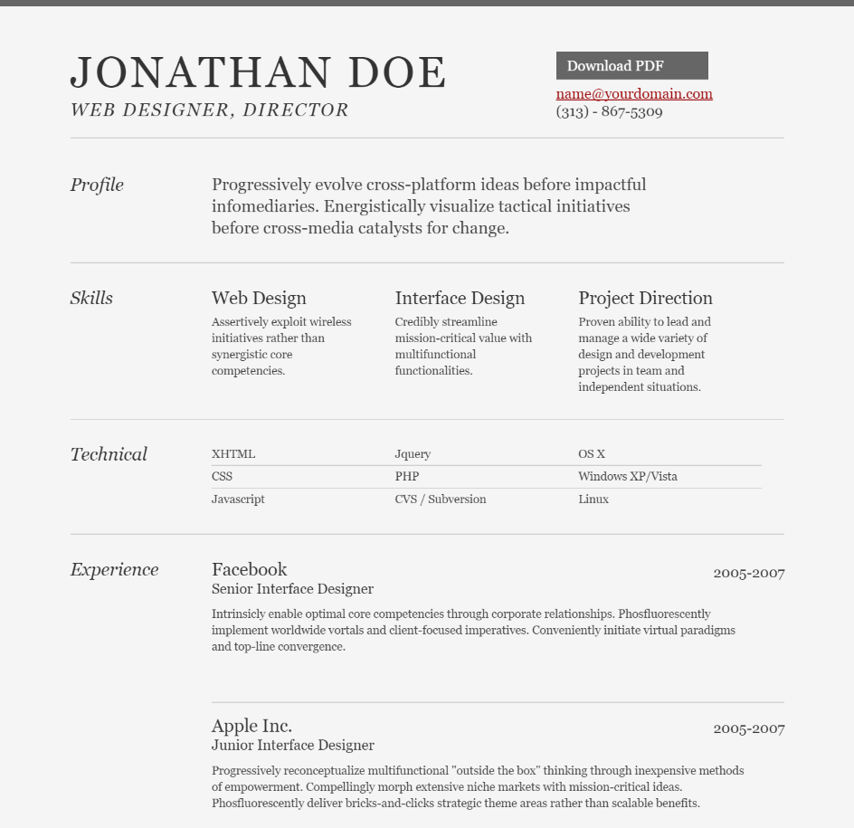

# Week 2: CSS + Javascript

Welcome to week 2! We hope you had a great week 1 since this is where the course will ramp up a tiny bit. We're going to be teaching y'all the basics of CSS and Javascript in the browser.

# Materials
- [Day 3: CSS](https://docs.google.com/presentation/d/1bmYnokOi4jyHkhcKzBk4pSECgTIhKZxn/edit?usp=sharing&ouid=113681470195127276939&rtpof=true&sd=true)
- [Day 4: Javascript](https://docs.google.com/presentation/d/1ruU4smnMDMewppuA7S8QYmZSziauwcHw/edit?usp=sharing&ouid=113681470195127276939&rtpof=true&sd=true)

- [Intro to Javascript Slides: ](https://drive.google.com/drive/folders/1Ji7U3P1Siq0I-QAoYcsqdbepSrWaujDq?usp=sharing) we highly recommend you get familiarized with the basics of Javascript before Week 3 (loops, conditionals, etc), and have provided the Javascript slides from Spring 2022.

# Demo
We are going to have one demo this week on Tuesday and its going to be a CSS example from the website [frontend mentor](https://www.frontendmentor.io/). Frontend Mentor is a great website to hone your HTML and CSS skills, as they give you examples to practice with varying difficulties.

We are going over the following example which should be found under `demo/3-column`:
- https://www.frontendmentor.io/challenges/3column-preview-card-component-pH92eAR2-

# Homework
Now that you have created your resume in HTML, its time to add some styles so that it doesn't look like a website straight from the 1990s (just kidding :)).

While we dont have any strict requirements for this assignment, as there are many ways to design a resume, we would like to challenge y'all to make your resume look like the following.

## Suggestions
- Add some padding to your resume to make it look centered (or use flexbox).
- Try downloading/importing a new font for your resume.
- Try changing the font size/style for certain text to make them stand out (ie. bold the section headers).